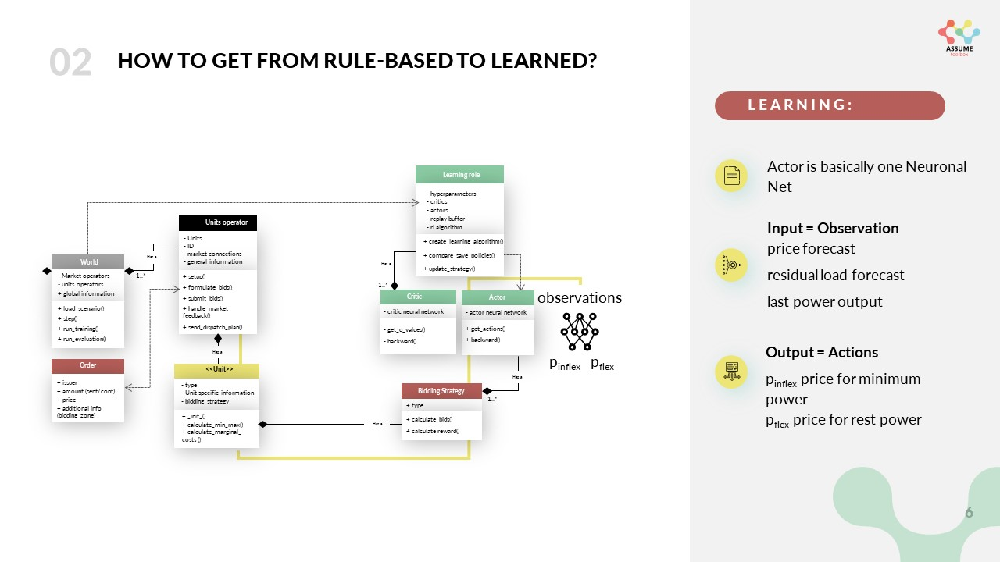
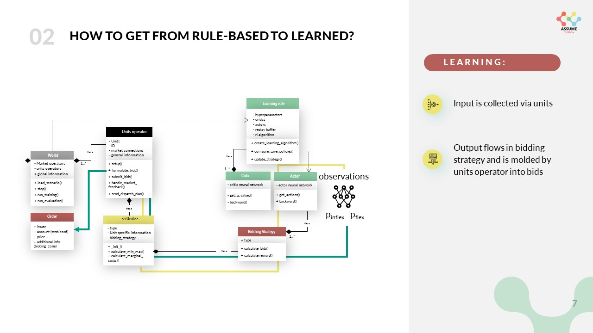
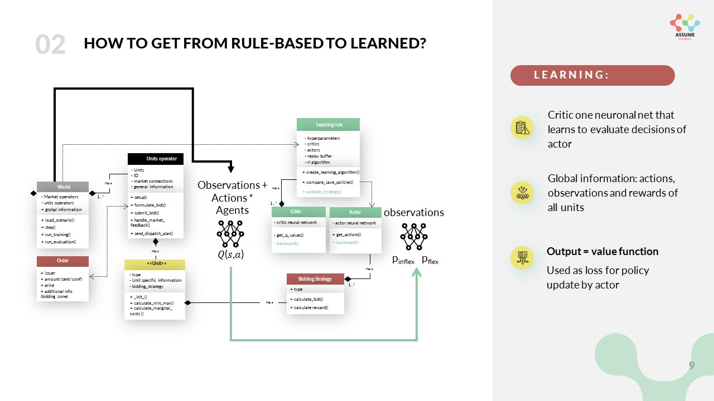
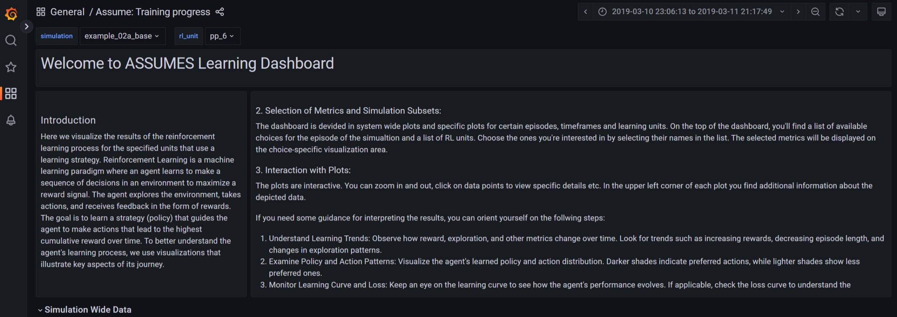
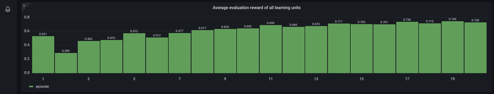

.. SPDX-FileCopyrightText: ASSUME Developers
..
.. SPDX-License-Identifier: AGPL-3.0-or-later

#######################################
Introduction to Reinforcement Learning
#######################################

One unique characteristic of ASSUME is the usage of Reinforcement Learning (RL) for the bidding of the agents.
To enable this the architecture of the simulation is designed in a way to accommodate the learning process. In this part of
the documentation, we give a short introduction to reinforcement learning in general and then pinpoint you to the
relevant parts of the code. The descriptions are mostly based on the following paper:

Harder, Nick & Qussous, Ramiz & Weidlich, Anke. (2023). Fit for purpose: Modeling wholesale electricity markets realistically with multi-agent deep reinforcement learning. Energy and AI. 14. 100295.

`Fit for purpose: Modeling wholesale electricity markets realistically with multi-agent deep reinforcement learning <https://doi.org/10.1016/j.egyai.2023.100295>`_

If you want a hands-on introduction check out the prepared tutorial in Colab: https://colab.research.google.com/github/assume-framework/assume

The Basics of Reinforcement Learning
=====================================

In general, RL and deep reinforcement learning (DRL) in particular, open new prospects for agent-based electricity market modeling.
Such algorithms offer the potential for agents to learn bidding strategies in the interplay between market participants.
In contrast to traditional rule-based approaches, DRL allows for a faster adaptation of the bidding strategies to a changing market
environment, which is impossible with fixed strategies that a market modeler explicitly formulates. Hence, DRL algorithms offer the
potential for simulated electricity market agents to develop bidding strategies for future markets and test emerging markets' mechanisms
before their introduction into real-world systems.

In the current implementation of ASSUME, we model the electricity market as a partially observable Markov game,
which is an extension of the Markov Decision Process for multi-agent setups. Multi-agent DRL is understood as the simultaneous learning of multiple agents
interacting in the same environment. The Markov game for :math:`N` agents consists of a set of states :math:`S`, a set of actions :math:`A_1, \ldots, A_N`,
a set of observations :math:`O_1, \ldots, O_N`, and a state transition function :math:`P: S \times A_1 \times \ldots \times A_N \rightarrow \mathcal{P}(S)` dependent on the state and actions of all agents.
After taking action :math:`a_i \in A_i` in state :math:`s_i \in S` according to a policy :math:`\pi_i: O_i \rightarrow A_i`, every agent :math:`i` is transitioned into the new state :math:`s'_i \in S`.
Each agent receives a reward :math:`r_i` according to the individual reward function :math:`R_i` and a private observation correlated with the state :math:`o_i: S \rightarrow O_i`.
Like in a Markov Decision Process, each agent :math:`i` learns an optimal policy :math:`\pi_i^*(s)` that maximizes its expected reward.

To enable multi-agent learning some adjustments are needed within the learning algorithm to get from the TD3 to an MATD3 algorithm.
Other authors used similar tweaks to improve the MADDPG algorithm and derive the MA-TD3 algorithm.
We'll start explaining the learning by focusing on a single agent and then extend it to multi-agent learning.

Single-Agent Learning
----------------------

We use the actor-critic approach to train the learning agent. The actor-critic approach is a popular RL algorithm that uses two
neural networks: an actor network and a critic network. The actor network is responsible for selecting actions, while the critic network
evaluates the quality of the actions taken by the actor.

Actor
^^^^^

The actor network is trained using the policy gradient method, which updates the weights of the actor network in the direction of the
gradient of the expected reward with respect to the network parameters:

.. math::

    \nabla_{\theta} J(\theta) = E[\nabla_{\theta} log \pi_{\theta}(a_t|s_t) * Q^{\pi}(s_t, a_t)]

where :math:`J(\theta)` is the expected reward, :math:`\theta` are the weights of the actor network, :math:`\pi_{\theta}(a_t|s_t)` is the probability of
selecting action :math:`a_t` given state :math:`s_t`, and :math:`Q^{\pi}(s_t, a_t)` is the expected reward of taking action :math:`a_t` in state :math:`s_t` under policy :math:`\pi`.

Critic
^^^^^^

The critic network is trained using the temporal difference (TD) learning method, which updates the weights of the critic
network based on the difference between the estimated value of the current state and the estimated value of the next state:

.. math::

    \delta_t = r_t + \gamma * V(s_{t+1}) - V(s_t)

where :math:`\delta_t` is the TD error,
:math:`r_t` is the reward obtained at time step :math:`t`,
:math:`\gamma` is the discount factor,
:math:`V(s_t)` is the estimated value of state :math:`s_t`, and
:math:`V(s_{t+1})` is the estimated value of the next state :math:`s_{t+1}`.

The weights of the critic network are updated in the direction of the gradient of the mean squared TD error:

.. math::

    \nabla_{\theta} L = E[(\delta_t)^2]

where L is the loss function.

The actor and critic networks are trained simultaneously using the actor-critic algorithm, which updates the weights of
both networks at each time step. The actor-critic algorithm is a form of policy iteration, where the policy is updated based on the
estimated value function, and the value function is updated based on the critic.

Multi-Agent Learning
------------------------

In a single-agent setup, the state transition and respective reward depend only on the actions of a single agent. However, in a
multi-agent setup, the state transitions and rewards depend on the actions of all learning agents. This makes the environment
non-stationary for a single agent, violating the Markov property. The convergence guarantees of single-agent RL algorithms are no longer
valid. To address this, we utilize the framework of centralized training and decentralized execution and expand upon the MADDPG algorithm.
The main idea is to use a centralized critic during the training phase, which has access to the entire state :math:`S`, and all actions :math:`a_1, \ldots, a_N`, thus resolving the issue of non-stationarity.
Changes in state transitions and rewards can be explained by the actions of other agents.
Meanwhile, during both training and execution, the actor has access only to its local observations :math:`o_i` derived from the entire state :math:`S`.

For each agent :math:`i`, we train not one but two centralized critics :math:`Q_{i,\theta_1,2}(S, a_1, \ldots, a_N)` together with two target critic networks.
Similar to TD3, the smaller value of the two critics and target action noise :math:`a_i,k \sim` is used to calculate the target :math:`y_i,k`. This is done to to address the issue of overestimation bias.

.. math::

    y_i,k = r_i,k + γ * min_j=1,2 Q_i,θ′_j(S′_k, a_1,k, ..., a_N,k, π′(o_i,k))

where :math:`r_i,k` is the reward obtained by agent :math:`i` at time step :math:`k`, :math:`\gamma` is the discount factor, :math:`S'_k` is the next state of the
environment, and :math:`\pi'(o_i,k)` is the target policy of agent :math:`i`.

The critics are trained using the mean squared Bellman error (MSBE) loss:

.. math::

    L(Q_i,θ_j) = E[(y_i,k - Q_i,θ_j(S_k, a_1,k, ..., a_N,k))^2]

The actor policy of each agent is updated using the deterministic policy gradient (DPG) algorithm:

.. math::

    ∇_a Q_i,θ_j(S_k, a_1,k, ..., a_N,k, π(o_i,k))|a_i,k=π(o_i,k) * ∇_θ π(o_i,k)

The actor is updated similarly using only one critic network :math:`Q_{θ1}`. These changes to the original DDPG algorithm allow increased stability and convergence of the TD3 algorithm. This is especially relevant when approaching a multi-agent RL setup, as discussed in the foregoing section.
Please note that the actor and critics are updated by sampling experience from the buffer where all interactions of the agents are stored, namely the observations, actions and rewards. There are more complex buffers possible, like those that use importance sampling, but the default buffer is a simple replay buffer. You can find a documentation of the latter in :ref:`replay-buffer`.

.. _learning_implementation:

The Learning Implementation in ASSUME
=====================================

Based on the described multi-agent RL approach we integrated these functionalities in ASSUME. In general, we only need to make adjustments in the bidding strategy of the power plants.
The rest of the learning capabilities are implemented in the learning role, which only needs to be adjusted in advanced case studies with ASSUME.

The Actor
---------

We will explain the way learning works in ASSUME starting from the interface to the simulation, namely the bidding strategy of the power plants.
The bidding strategy, per definition in ASSUME, defines the way we formulate bids based on the technical restrictions of the unit.
In a learning setting, this is done by the actor network which maps the observation to an action. The observation thereby is managed and collected by the units operator as
summarized in the following picture. As you can see in the current working version, the observation space contains a residual load forecast and a price
forecast for example for the next 24 hours, as well as the current capacity of the power plant and its marginal costs.

The action space is a continuous space, which means that the actor can choose any price between 0 and the maximum bid price defined in the code. It gives two prices for two different parts of its capacity.
One, namely :math:`p_{inflex}` for the minimum capacity of the power plant and one for the rest ( :math:`p_{flex}`). The action space is defined in the config file and can be adjusted to your needs.
After the bids are formulated in the bidding strategy they are sent to the market via the units operator.

In the case you are eager to integrate different learning bidding strategies or equip a new unit with learning,
you need to touch these methods. To enable an easy start with the use of reinforcement learning in ASSUME we provide a tutorial in colab on GitHub.

The Critic
----------

The critic is used to calculate the loss of the actor. It constantly learns to evaluate the actions chosen by the actor
based on global information. The following graph shows the information flow.

The learning role orchestrates this learning process. It initializes the training process, handles the algorithms and manages the experiences gained in a buffer.
You can read more about the different algorithms and the learning role in :doc:`learning_algorithm`.

The Learning Results in ASSUME
=====================================

Learning results are not easy to understand and judge. ASSUME supports different visualizations to track the learning progress.
Further we want to raise awareness for common pitfalls with learning result interpretation.

Visualizations
--------------

Similarly to the other results, the learning progress is tracked in the database, either with PostgreSQL or TimescaleDB. The latter enables the usage of the
predefined dashboards to track the learning process in the "ASSUME:Training Process" dashboard. The following pictures show the learning process of a simple reinforcement learning setting.
A more detailed description is given in the dashboard itself.

In accordance with common machine learning practices and to align with widely accepted learning standards, we also integrate **TensorBoard** to visualize
the training process. This provides a familiar and intuitive interface for users who have experience with deep learning frameworks, where TensorBoard is
a de-facto standard for inspecting metrics such as losses, gradients, hyperparameters, and model behavior over time.

TensorBoard logs are automatically written to the directory specified in the project (here ``./tensorboard/``).

To launch TensorBoard locally, run:

.. code-block:: bash

    tensorboard --logdir ./tensorboard --port 6006

After starting the server, open the following URL in your browser:

::

    http://localhost:6006

TensorBoard will then display dashboards for scalars, histograms, graphs, projectors, and other relevant visualizations, depending on the metrics that
the training pipeline currently exports.

Interpretation
--------------

Once the environment and learning algorithm are specified, agents are trained and behaviors begin to emerge. The modeler (you) analyzes the reward in the
visualizations described above. This raises a basic modeling question:

    *How can we judge whether what has been learned is meaningful?*

Unlike supervised learning, we do not have a ground-truth target or an error metric that reliably decreases as behavior improves. In multi-agent settings,
the notion of an “optimal” solution is often unclear. What we *do* observe are rewards – signals chosen by the modeler. How informative these signals are
depends heavily on the reward design and on how other agents behave. Therefore:

    **Do not rely on rewards alone.** Behavior itself must be examined carefully.

**Why solely reward-based evaluation is problematic**

Let :math:`R_i` denote the episodic return of agent :math:`i` under the joint policy :math:`\pi=(\pi_1,\dots,\pi_n)`. A common but potentially misleading
heuristic is to evaluate behavior by the total reward,
.. math::

    S(\pi) = \sum_{i=1}^n \mathbb{E}[R_i].

A larger :math:`S(\pi)` does *not* imply that the learned behavior is better or more stable. In a multi-agent environment, each agent’s learning alters the
effective environment faced by the others. The same policy can therefore earn very different returns depending on which opponent snapshot it encounters. High
aggregate rewards can arise from:

* temporary exploitation of weaknesses of other agents,
* coordination effects that occur by chance rather than by design,
* behavior that works against training opponents but fails in other situations.

Rewards are thus, at best, an indirect proxy for “good behavior.” They measure how well a policy performs *under the specific reward function and opponent
behavior*, not whether it is robust, interpretable, or aligned with the modeler’s intent.

**Implications for policy selection**

This issue becomes visible when deciding which policy to evaluate at the end of training. We generally store (i) the policy with the highest average reward and
(ii) the final policy. However, these two can differ substantially in their behavior. The framework therefore uses the **final policy** for evaluation to
avoid selecting a high-reward snapshot that may be far from stable.

The most robust learning performance can be achieved through **early stopping** with a very large number of episodes. In that case, training halts once results
are stable, and the final policy is likely also the stable one. This behavior should be monitored by the modeler in TensorBoard.
