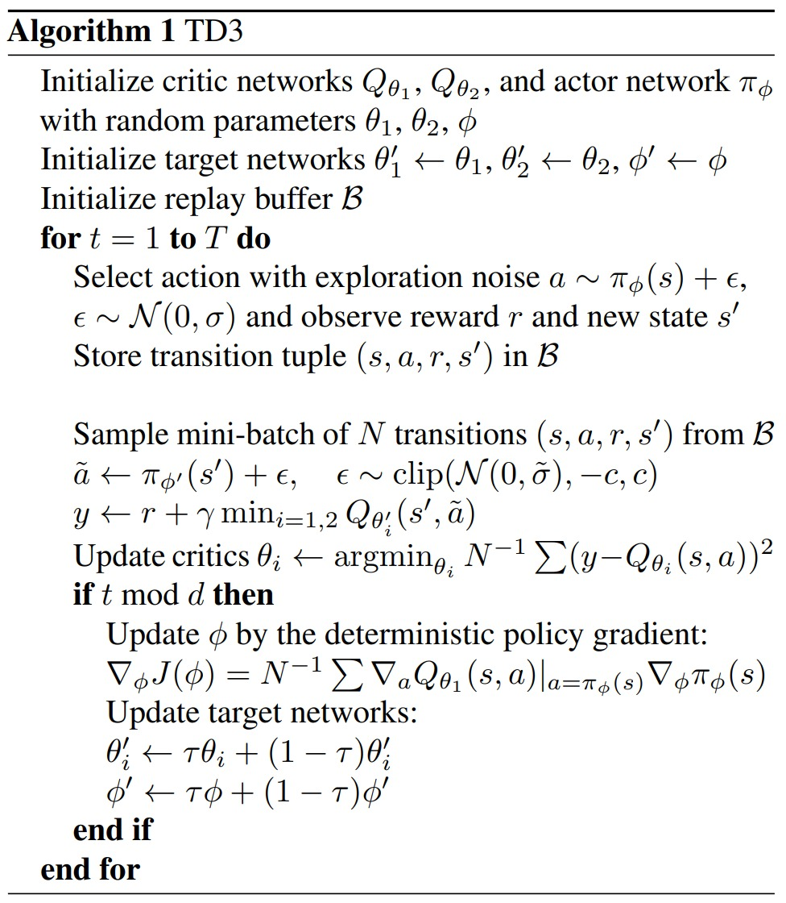

.. SPDX-FileCopyrightText: ASSUME Developers
..
.. SPDX-License-Identifier: AGPL-3.0-or-later

##################################
Reinforcement Learning Algorithms
##################################

In the chapter :doc:`learning` we got a general overview of how RL is implemented for a multi-agent setting in Assume.
If you want to apply these RL algorithms to a new problem, you do not necessarily need to understand how the RL algorithms work in detail.
All that is needed is to adapt the bidding strategies, which is covered in the tutorial.
However, for the interested reader, we will give a brief overview of the RL algorithms used in Assume.
We start with the learning role, which is the core of the learning implementation.

The Learning Role
=================

The learning role orchestrates the learning process. It initializes the training process and manages the experience gained in a buffer.
It also schedules policy updates, thus bringing critic and actor together during the learning process.
Specifically, this means that at the beginning of the simulation we schedule recurrent policy updates, where the output of the critic
is used as a loss for the actor, which then updates its weights using backward propagation.

With the learning role, we can also choose which RL algorithm should be used. The algorithm and the buffer have base classes and can be customized if needed.
But without touching the code there are easy adjustments to the algorithms that can and eventually need to be done in the config file.
The following table shows the options that can be adjusted and gives a short explanation. For more advanced users, the functionality of the algorithm is also documented below.

 ======================================== ==========================================================================================================
  learning config item                    description
 ======================================== ==========================================================================================================
  continue_learning                       Whether to use pre-learned strategies and then continue learning.
  trained_policies_save_path              Where to store the newly trained rl strategies - only needed when learning_mode is set
  trained_policies_load_path              If pre-learned strategies should be used, where are they stored? - only needed when continue_learning
  max_bid_price                           The maximum bid price which limits the action of the actor to this price.
  learning_mode                           Should we use learning mode at all? If not, the learning bidding strategy is overwritten with a default strategy.
  algorithm                               Specifies which algorithm to use. Currently, only MATD3 is implemented.
  actor_architecture                      The architecture of the neural networks used in the algorithm for the actors. The architecture is a list of names specifying the "policy" used e.g. multi layer perceptron (mlp).
  learning_rate                           The learning rate, also known as step size, which specifies how much the new policy should be considered in the update.
  learning_rate_schedule                  Which learning rate decay to use. Defaults to None. Currently only "linear" decay available.
  training_episodes                       The number of training episodes, whereby one episode is the entire simulation horizon specified in the general config.
  episodes_collecting_initial_experience  The number of episodes collecting initial experience, whereby this means that random actions are chosen instead of using the actor network
  train_freq                              Defines the frequency in time steps at which the actor and critic are updated.
  gradient_steps                          The number of gradient steps.
  batch_size                              The batch size of experience considered from the buffer for an update.
  gamma                                   The discount factor, with which future expected rewards are considered in the decision-making.
  device                                  The device to use.
  noise_sigma                             The standard deviation of the distribution used to draw the noise, which is added to the actions and forces exploration.
  noise_dt                                Determines how quickly the noise weakens over time / used for noise scheduling.
  noise_scale                             The scale of the noise, which is multiplied by the noise drawn from the distribution.
  action_noise_schedule                   Which action noise decay to use. Defaults to None. Currently only "linear" decay available.
  early_stopping_steps                    The number of steps considered for early stopping. If the moving average reward does not improve over this number of steps, the learning is stopped.
  early_stopping_threshold                The value by which the average reward needs to improve to avoid early stopping.
 ======================================== ==========================================================================================================

The Algorithms
==============

TD3 (Twin Delayed DDPG)
-----------------------

TD3 is a direct successor of DDPG and improves it using three major tricks: clipped double Q-Learning, delayed policy update and target policy smoothing.
We recommend reading the OpenAI Spinning guide or the original paper to understand the algorithm in detail.

Original paper: https://arxiv.org/pdf/1802.09477.pdf

OpenAI Spinning Guide for TD3: https://spinningup.openai.com/en/latest/algorithms/td3.html

Original Implementation: https://github.com/sfujim/TD3

In general, the TD3 works in the following way. It maintains a pair of critics and a single actor. For each step (after every time interval in our simulation), we update both critics towards the minimum
target value of actions selected by the current target policy:

.. math::
    & y=r+\gamma \min _{i=1,2} Q_{\theta_i^{\prime}}\left(s^{\prime}, \pi_{\phi^{\prime}}\left(s^{\prime}\right)+\epsilon\right), \\
    & \epsilon \sim \operatorname{clip}(\mathcal{N}(0, \sigma),-c, c)

Every :math:`d` iterations, which is implemented with the train_freq, the policy is updated with respect to :math:`Q_{\theta_1}` following the deterministic policy gradient algorithm (Silver et al., 2014).
TD3 is summarized in the following picture from the authors of the original paper (Fujimoto, Hoof and Meger, 2018).

The steps in the algorithm are translated to implementations in ASSUME in the following way.
The initialization of the actors and critics is done by the :func:`assume.reinforcement_learning.algorithms.matd3.TD3.initialize_policy` function, which is called
in the learning role. The replay buffer needs to be stable across different episodes, which corresponds to runs of the entire simulation, hence it needs to be detached from the
entities of the simulation that are killed after each episode, like the learning role. Therefore, it is initialized independently and given to the learning role
at the beginning of each episode. For more information regarding the buffer see :ref:`replay-buffer`.

The core of the algorithm is embodied by the :func:`assume.reinforcement_learning.algorithms.matd3.TD3.update_policy` in the learning algorithms. Here, the critic and the actor are updated according to the algorithm.

The network architecture for the actor in the RL algorithm can be customized by specifying the network architecture used.
In stablebaselines3 they are also referred to as "policies". The architecture is defined as a list of names that represent the layers of the neural network.
For example, to implement a multi-layer perceptron (MLP) architecture for the actor, you can set the "actor_architecture" config item to ["mlp"].
This will create a neural network with multiple fully connected layers.

Other available options for the "policy" include Long-Short-Term Memory (LSTMs). The architecture for the observation handling is implemented from [2].
Note, that the specific implementation of each network architecture is defined in the corresponding classes in the codebase. You can refer to the implementation of each architecture for more details on how they are implemented.

[2] Y. Ye, D. Qiu, J. Li and G. Strbac, "Multi-Period and Multi-Spatial Equilibrium Analysis in Imperfect Electricity Markets: A Novel Multi-Agent Deep Reinforcement Learning Approach," in IEEE Access, vol. 7, pp. 130515-130529, 2019, doi: 10.1109/ACCESS.2019.2940005.

.. _replay-buffer:

##############
Replay Buffer
##############

This chapter gives you an insight into the general usage of buffers in reinforcement learning and how they are implemented in ASSUME.

Why do we need buffers?
=======================

In reinforcement learning, a buffer, often referred to as a replay buffer, is a crucial component in algorithms like for Experience Replay.
It serves as a memory for the agent's past experiences, storing tuples of observations, actions, rewards, and subsequent observations.

Instead of immediately using each new experience for training, the experiences are stored in the buffer. During the training process,
a batch of experiences is randomly sampled from the replay buffer. This random sampling breaks the temporal correlation in the data, contributing to a more stable learning process.

The replay buffer improves sample efficiency by allowing the agent to reuse and learn from past experiences multiple times.
This reduces the reliance on new experiences and makes better use of the available data. It also helps mitigate the effects of non-stationarity in the environment,
as the agent is exposed to a diverse set of experiences.

Overall, the replay buffer is instrumental in stabilizing the learning process in reinforcement learning algorithms,
enhancing their robustness and performance by providing a diverse and non-correlated set of training samples.

How are they used in Assume?
============================
In principal Assume allows for different buffers to be implemented. They just need to adhere to the structure presented in the base buffer. Here we will present the different buffers already implemented, which is only one, yet.

The simple replay buffer
------------------------

The replay buffer is currently implemented as a simple circular buffer, where the oldest experiences are discarded when the buffer is full. This ensures that the agent is always learning from the most recent experiences.
Yet, the buffer is quite large to store all observations also from multiple agents. It is initialised with zeros and then gradually filled. Basically after every step of the environment the data is collected in the learning role which sends it to the replay buffer by calling its add function.

After a certain round of training runs which is defined in the config file the RL strategy is updated by calling the update function of the respective algorithms which calls the sample function of the replay buffer.
The sample function returns a batch of experiences which is then used to update the RL strategy.
For more information on the learning capabilities of ASSUME, see :doc:`learning`.
